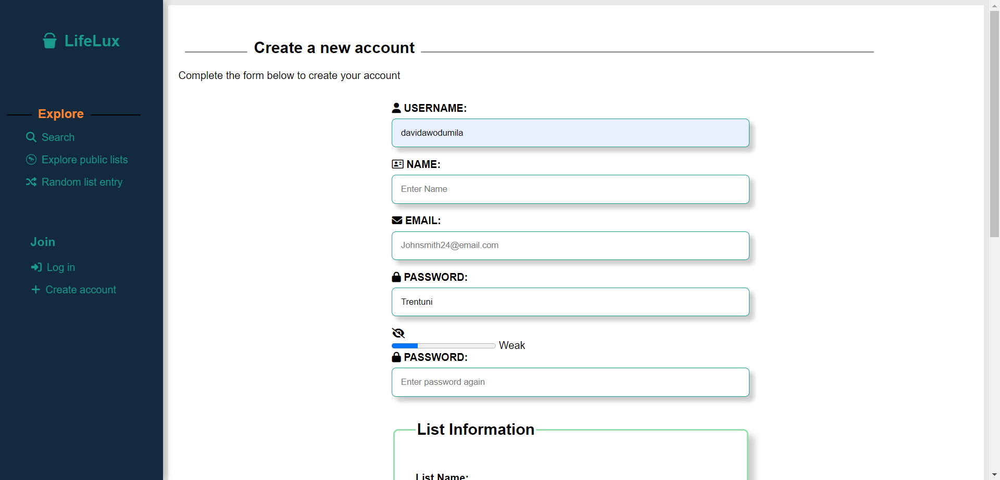

# 3420 Assignment #4 - Fall 2023

Name(s):David Awodumila

Live Loki link(s):

[register page link](https://loki.trentu.ca/~davidawodumila/3420/assn/assn4/register.php)
[index page link](https://loki.trentu.ca/~davidawodumila/3420/assn/assn4/index.php)
[Edit-item page link](https://loki.trentu.ca/~davidawodumila/3420/assn/assn4/edit-item.php)
[View-item page link](https://loki.trentu.ca/~davidawodumila/3420/assn/assn4/view-item.php)
[Login page link](https://loki.trentu.ca/~davidawodumila/3420/assn/assn4/Login.php)
[forgot page link](https://loki.trentu.ca/~davidawodumila/3420/assn/assn4/forgot.php)
[Search page link](https://loki.trentu.ca/~davidawodumila/3420/assn/assn4/Search.php)
[add-list page link](https://loki.trentu.ca/~davidawodumila/3420/assn/assn4/add-list.php)
[first page link](https://loki.trentu.ca/~davidawodumila/3420/assn/assn4/first-page.php)
[public list page link](https://loki.trentu.ca/~davidawodumila/3420/assn/assn4/list.php)

## Rubric

| Component                                                    | Grade |
| :----------------------------------------------------------- | ----: |
| Edit List Validation                                         |    /4 |
| Register Validation                                          |    /4 |
| Delete confirmation                                          |    /3 |
| Details modal                                                |    /5 |
|                                                              |       |
| Copy Public Link to Clipboard                                |    /3 |
| * Unique Username                                              |    /3 |
| * Password Strength                                            |    /3 |
| * Show Password                                                |    /3 |
| * Limiting Description Field                                   |    /3 |
| Star Rating                                                  |    /3 |
|                                                              |       |
| Code Quality (tidyness, validity, efficiency, etc)           |    /4 |
| Documentation                                                |    /3 |
| Testing                                                      |    /3 |
|                                                              |       |
| Bonus                                                        |  /3.5 |
| Deductions (readability, submission guidelines, originality) |       |
|                                                              |       |
| Total                                                        |   /35 |

## Things to consider for Bonus Marks (if any)


## Code & Testing

Put your code and screenshots here, **with proper heading organization**. You don't need to include html/php code (or testing) for any pages that aren't affected by your javascript for this assignment.


### Register page 
### Javascript

````js
"use strict";

const checkEmail = str => /^[^\s@]+@[^\s@]+\.[^\s@]+$/.test(str);

const FORM = document.getElementById('form')

const show = document.getElementById('show-password-icon')
show.addEventListener("click", (e) =>

{
    const passwordInput = document.getElementById("passwd");
    const showPasswordIcon = document.getElementById("show-password-icon");

    // Toggle the type attribute of the password input
    if (passwordInput.type === "password") {
        passwordInput.type = "text";
        showPasswordIcon.classList.remove("fa-eye");
        showPasswordIcon.classList.add("fa-eye-slash");
    } else {
        passwordInput.type = "password";
        showPasswordIcon.classList.remove("fa-eye-slash");
        showPasswordIcon.classList.add("fa-eye");
}
})


if (FORM) {

    // Select all of the elements we'll need in order to perform validation.
    const usernameInput = document.getElementById("username")
    const usernameError = usernameInput.nextElementSibling;

    const nameInput = document.getElementById("name")
    const nameError = nameInput.nextElementSibling;

    const emailInput = document.getElementById("email");
    const emailError = emailInput.nextElementSibling;

    FORM.addEventListener("submit", (ev) => {
        let errors = false;

        //check is name is empty 
        if (nameInput.value.trim() === ""){
            nameError.classList.remove('hidden');
            errors = true;
        }else {
            nameError.classList.add('hidden');
        }
        // check if username is empty and handle appropriately
        if (usernameInput.value.trim() === "") {
            usernameError.classList.remove('hidden');
            errors = true;
        } else {
            usernameError.classList.add('hidden');
        }


        // check if email is valid and handle appropriately
        if (checkEmail(emailInput.value)) {
            emailError.classList.add('hidden');
        } else {
            emailError.classList.remove('hidden');
            errors = true;
        }

        // IF THERE ARE ERRORS, PREVENT FORM SUBMISSION
        if (errors) {
            ev.preventDefault();
        }
    });
}


const passwordInput = document.getElementById("passwd");
const passwordStrength = document.getElementById("password-strength");
const passwordStrengthText = document.getElementById("password-strength-text");

passwordInput.addEventListener("input", () => {
    const password = passwordInput.value;

    // Calculate password strength
    const strength = calculatePasswordStrength(password);

    // Update progress bar
    passwordStrength.value = strength;

    // Update strength text
    const strengthText = getStrengthText(strength);
    passwordStrengthText.innerText = strengthText;
});

function calculatePasswordStrength(password) {
    const hasUpperCase = /[A-Z]/.test(password);
    const hasNumber = /\d/.test(password);
    const hasSpecialChar = /[!@#$%^&*(),.?":{}|<>]/.test(password);
    const length = password.length;

    if (hasSpecialChar && hasNumber && hasUpperCase && length > 5) {
        return 100;
    } else if (hasNumber && hasUpperCase && length > 5) {
        return 75;
    } else if (hasUpperCase && hasNumber) {
        return 50;
    } else if (hasUpperCase) {
        return 25;
    } else {
        return 0;
    }
}

function getStrengthText(strength) {
    if (strength === 100) {
        return "Very Strong";
    } else if (strength >= 75) {
        return "Strong";
    } else if (strength >= 50) {
        return "Moderate";
    } else if (strength >= 25) {
        return "Weak";
    } else {
        return "Very Weak";
    }
}

````

### Testing
### screenshot of user leaving all fields blank and hitting submit

### screenshot of user leaving all fields blank and hitting submit in Microsoft Edge


### Screenshot of user viewing their password using the view button

### Screenshot of user viewing their password using the view button in Microsoft Edge


### screenshot of user password strength being very strong 

### screenshot of user password strength being very strong in Microsoft Edge


### Edit List item

````js
const edit = document.getElementById("editForm");

if (edit) {
    const titleInput = document.getElementById("title");
    const titleError = titleInput.nextElementSibling;

    const aboutDescriptionInput = document.getElementById("about_description");
    const aboutDescriptionError = aboutDescriptionInput.nextElementSibling;

    const ratingInput = document.getElementById("rating");
    const ratingError = ratingInput.nextElementSibling;

    const aboutInput = document.getElementById("about");
    const aboutError = aboutInput.nextElementSibling;
    const aboutCharCount = document.getElementById("about-char-count"); // Moved it inside the block

    const dateInput = document.getElementById("date");
    const dateError = dateInput.nextElementSibling;

    const completeInput = document.getElementById("complete");
    const completeError = completeInput.nextElementSibling;

    const aboutCharLimit = 2500;

    edit.addEventListener("submit", (ev) => {
        let errors = false;
        if (titleInput.value.trim() === "") {
            titleError.classList.remove('hidden');
            errors = true;
        } else {
            titleError.classList.add('hidden');
        }
        if (aboutDescriptionInput.value.trim() === "") {
            aboutDescriptionError.classList.remove('hidden');
            errors = true;
        } else {
            aboutDescriptionError.classList.add('hidden');
        }

        if (aboutInput.value.trim() === "") {
            aboutError.classList.remove('hidden');
            errors = true;
        } else {
            aboutError.classList.add('hidden');
        }

        // Check for the character limit in 'about' field
        if (aboutInput.value.length > aboutCharLimit) {
            aboutError.classList.remove('hidden');
            errors = true;
        } else {
            aboutError.classList.add('hidden');
        }

        // Update character count indicator
        aboutCharCount.innerText = `${aboutCharLimit - aboutInput.value.length} characters left`;

        // Check for the date input
        if (dateInput.value.trim() === "") {
            dateError.classList.remove('hidden');
            errors = true;
        } else {
            dateError.classList.add('hidden');
        }

        // IF THERE ARE ERRORS, PREVENT FORM SUBMISSION
        if (errors) {
            ev.preventDefault();
        }
    });

    // Add event listener for input change in 'about' field
    aboutInput.addEventListener('input', () => {
        // Truncate the input if it exceeds the character limit
        if (aboutInput.value.length > aboutCharLimit) {
            aboutInput.value = aboutInput.value.substring(0, aboutCharLimit);
        }
        // Check for the character limit in 'about' field
        if (aboutInput.value.length > aboutCharLimit) {
            aboutError.classList.remove('hidden');
            errors = true;
        } else {
            aboutError.classList.add('hidden');
        }

        // Update character count indicator
        aboutCharCount.innerText = `${aboutCharLimit - aboutInput.value.length} characters left`;
    });
}

````

### screenshot of user leaving all fields blank and hitting submit in the edit list page

### screenshot of user leaving all fields blank and hitting submit in the edit list page in microsoft edge


### screenshot of a limited about field

### screenshot of a limited about field in microsoft edge


### Ajax Request

````js
const usernameInput = document.getElementById("username");
const usernameError = usernameInput.nextElementSibling;
usernameInput.addEventListener('input', () => {
    const enteredUsername = usernameInput.value.trim();

    // Make an AJAX request to check if the username exists
    const xhr = new XMLHttpRequest();
    xhr.onreadystatechange = function () {
        if (xhr.readyState === 4 && xhr.status === 200) {
            const response = JSON.parse(xhr.responseText);

            if (response.exists) {
                // Username exists, show an error
                usernameError.classList.remove('hidden');
            } else {
                // Username is available, hide the error
                usernameError.classList.add('hidden');
            }
        }
    };

    // Open and send the AJAX request
    xhr.open('POST', 'check_username.php', true);
    xhr.setRequestHeader('Content-type', 'application/x-www-form-urlencoded');
    xhr.send('username=' + encodeURIComponent(enteredUsername));
});

````
### screenshot of user trying to use a username that already exists in the database

### screenshot of user trying to use a username that already exists in the database in microsoft edge


